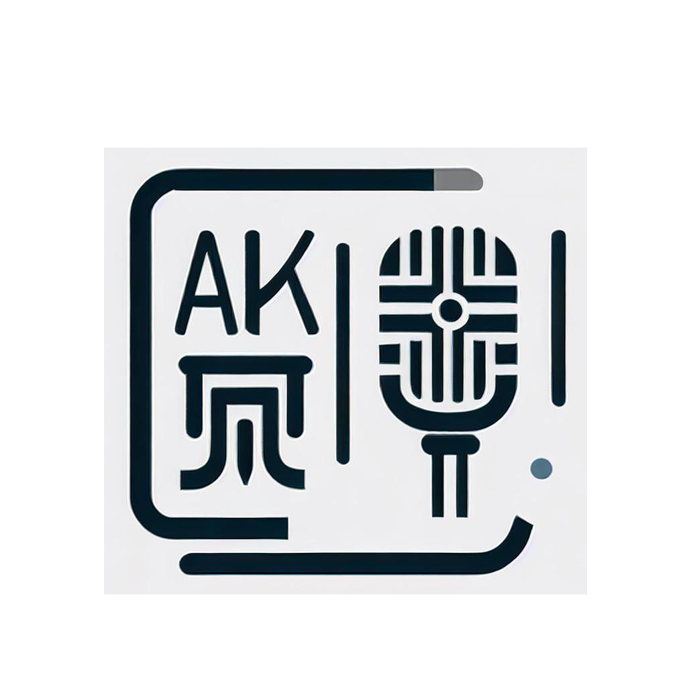
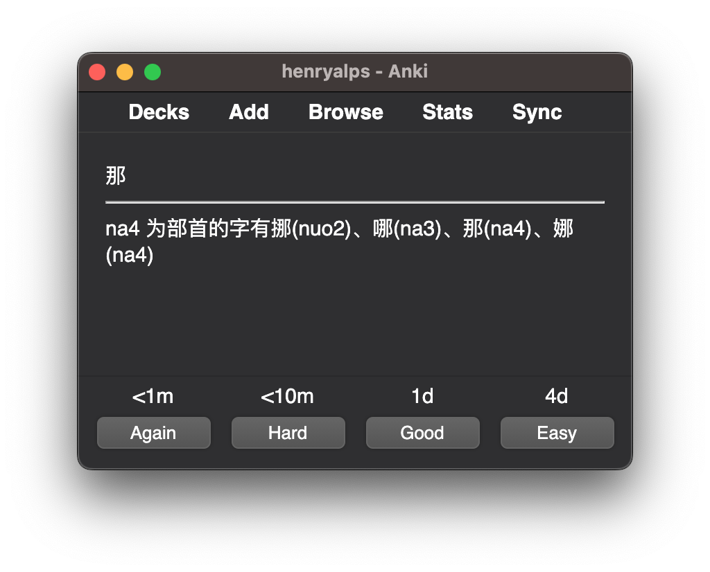

# 
Chinese-Homophone

    

## Background

    

[中文](README_zh.md)

When learning Chinese pinyin, it is common to encounter problems with confusing sounds, such as distinguishing between flat and raised tongue sounds, front and back nasal sounds, and nasal and non-nasal sounds. This requires users to memorize these sounds, which can be time-consuming and laborious. Since Chinese characters are pictographic, many characters' pronunciations are similar to their radical pronunciations. By memorizing the radical pronunciations, the efficiency of memorization can be improved. However, there is no comprehensive compilation of radical pronunciations on the internet. Some web pages mention that there is a "Representative Characters and Sound Combination Rules Table" in textbooks, which is worth further investigation. The purpose of developing this project is to match the pronunciations and radicals of commonly used Chinese characters, find representative characters that are easily confused, and generate anki flashcards, as shown in the `pic/2.png` image, to improve memorization efficiency.

## Content

This project is written in Python and includes the following files:

- `PinYinParts.py`: Used to extract the pinyin and radicals of Chinese characters.
- `main.py`: The main program, used to match the pinyin and radicals of Chinese characters and generate anki flashcards.
- `char_common_detail.json`: Detailed information on commonly used Chinese characters.
- `data.pkl`: The mapping relationship between radicals and Chinese characters.

The generated anki flashcards include training and test sets, which can be downloaded from `Realease`. Users can first memorize the representative characters with the training set and then verify the memorization effect with the test set.

## How to Use

1. Download the project files.
2. Install Python and pip.
3. Install dependencies: `pip install -r requirements.txt`.
4. Run the `main.py` file to generate anki flashcards.

## Contributors

This project is an open-source project, and developers are welcome to contribute. If you find any problems or have any suggestions, please submit an issue or pull request on GitHub.

## License

This project uses the MIT license. Please see the LICENSE file for more information.