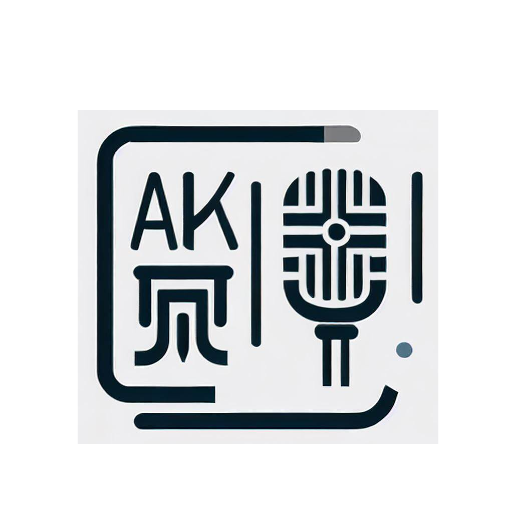

# 
Chinese-Homophone

    

## 背景

    

在学习汉语拼音时，经常会出现平翘舌不分、前后鼻音不分，以及鼻边音不分的混音问题，此时就需要用户去背诵这些拼音，耗时耗力。由于汉字是象形文字，因此很多字的读音都和它们的部首读音类似。通过记忆部首的读音，就可以提升背诵的效率。但是，网络上并没有一个对部首读音全面的整理。有网页提到教材中有“代表字及声韵搭配规律表”，值得进一步检索。开发这个项目的目的是通过对常用汉字的读音及部首的匹配，找到常见的易混音代表字，并生成anki牌组，如`pic/1.png`图片所示，以提升背诵效率。

## 内容

该项目使用Python编写，包括以下文件：

- `PinYinParts.py`：用于提取汉字的拼音和部首。
- `main.py`：主程序，用于匹配汉字的拼音和部首，并生成anki牌组。
- `char_common_detail.json`：常用汉字的详细信息。
- `data.pkl`：部首和汉字的映射关系。

生成的anki牌组包括训练集与测试集两个文件，可以在`Realease`中下载到。用户可以先用训练集背诵代表字，再用测试集验证背诵效果。

## 如何使用

1. 下载项目文件。
2. 安装Python和pip。
3. 安装依赖项：`pip install -r requirements.txt`。
4. 运行`main.py`文件，生成anki牌组。

## 贡献者

该项目是一个开源项目，欢迎各位开发者参与贡献。如果您发现了任何问题或有任何建议，请在GitHub上提交issue或pull request。

## 许可证

该项目使用MIT许可证。请查看LICENSE文件以获取更多信息。